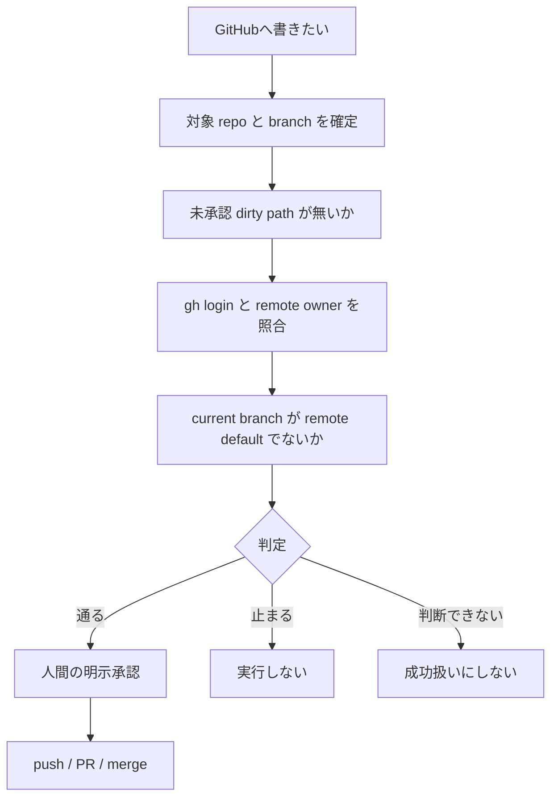

# github-ops-skills

複数の GitHub アカウントと repository を扱うとき、対象・identity・権限・承認を混ぜないための小さな Core Suite です。Codex / Claude / Grok は同じ `skills/` を見ます。書き込み前に fail-closed で止まります。

## 目的

GitHub へ書く直前に、今どの owner の、どの repo に触ろうとしているかを identity と remote から確定します。write 権限の有無は照会しません。確定できない操作は実行しません。

公開判断、テスト成功、Settings 変更は別の承認です。この repo はフル orchestrator ではなく、既存 skill を直列につなぐだけです。

接続順の正本は [運用カード](docs/operating-card.md) です。判定の回帰は [tests/unit/test_write_preflight.py](tests/unit/test_write_preflight.py) です。

図の判定は `scripts/preflight_write_gate.py`（location / dirty / identity / default-branch）全体です。identity 照合だけを通しても write には足りません。

機械の返り値は `READY` / `BLOCKED` / `UNKNOWN` の3状態です。`UNKNOWN` を成功扱いしません。右下の承認は自動では変わりません。

## できること

- GitHub CLI の active account と remote owner を照合する（`scripts/gh_identity_probe.py` / `scripts/preflight_write_gate.py`）
- PR の title/body が日本語境界を満たすか検査する（CI: `PR日本語gate`）
- runtime skill が `skills/` 正本からずれていないか検査する
- skill manifest の `ssot_pointers` がこの repository に実在するかを `scripts/verify_skill_manifests.py` で CI 必須にする（[ADR-0005](docs/adr/0005-skill-manifest-pointers-must-exist-in-this-repository.md)）
- ADR の採番が一意で、file 名と見出しの番号が一致するかを `scripts/verify_adr_numbering.py` で CI 必須にする（[ADR-0007](docs/adr/0007-adr-numbers-must-be-unique.md)）
- 各 checker が「対象が無い / 空」を pass にしないことを、壊れた repo を実際に食わせて `scripts/verify_checker_contracts.py` で CI 必須にする（[ADR-0008](docs/adr/0008-checkers-must-reject-empty-subjects.md)）
- `tracked ∧ ignored` の新規増加を `ai-ratchet-gate` が CI で検出する（required check 未設定のため merge は機械強制しない）
- review thread を本文推定せず、既存 audit 判定だけで扱う
- `PUBLIC_READY.md` の visibility 宣言を未ログイン HTTP（200=PUBLIC / 404=PRIVATE）と `scripts/check_visibility_claim.py` で CI 照合する。owner ログインの `gh repo view` は公開 oracle ではない。不一致は BLOCKED
- 現行 committed tree（既定 `--range HEAD`）の個人絶対パス pattern を `scripts/public_identity_guard.py` で検査する。`git show` 経由の blob は CommandRunner が先に `ghp_` / `github_pat_` 等を redact するため、この経路では committed GitHub token 形状を検出できない（秘匿は維持。token 検知を主張しない）
- GitHub read-only L3 は既存の `scripts/run_read_only_e2e.py`（repository 外 overlay）。手順は [docs/operations.md](docs/operations.md)。`UNKNOWN` を READY にしない

既存 CI（file 側）: `Core Suite CI`（pytest / adapter / skill manifest pointers / ADR 採番 / checker 契約 / visibility claim 等）、`ai-ratchet-gate`、`PR日本語gate`、`PRセルフレビュー（base監査 advisory）`。required status checks は Settings。

やらないこと: visibility 変更の自動化、自動 merge、token の保存、home 設定の書き換え。

## クイックスタート

この repository を AI に読ませるときは、下の URL を貼ってください。

https://github.com/nexus-ai-2045/github-ops-skills

貼った相手には、先に危険レビューを出してください。削除、GitHub write、visibility 変更、secret の取り扱い、unknown を安全と読まないこと。`READY` やテスト成功は公開承認ではありません。

人の手元で pytest を回す手順は [CONTRIBUTING.md](CONTRIBUTING.md) です。

## 安全境界

- 通常の probe と E2E は read-only です
- global な `gh` active account を切り替えません
- token を file・引数・出力へ保存しません
- push / PR / merge / repository 作成 / visibility 変更は、現在会話の明示承認が必要です
- PR title/body は日本語 gate を通し、作成後に read-back します
- required status checks は GitHub Settings であり、この repo の file 差分ではありません

## 必須契約

既存の gate と sibling 正本だけを使います。新しい protocol や script は足しません。

| 契約 | この repo での扱い |
|---|---|
| `repo-preflight` / `public-repo-readiness` | 公開前の判断材料。visibility は自動変更しない |
| この Core Suite | identity / 日本語 gate / adapter。正本は `skills/` |
| `engineering-brain` | 判断が必要な作業のときだけ |
| FDE | skill 内 FDE Packet と同じ契約 |
| `ai-ratchet-gate` | 既存の昇格・回帰 gate。エンジンは再実装しない |
| `nexus-management-os` | 運用 OS 側の既存契約 |
| `nexus_ai` | mainline / 最新参照。第二複製にしない |

## ライセンスと出典

コードは [MIT License](LICENSE) です。Copyright (c) 2026 nexus_ai。

検査ロジックの一部は sibling 正本を呼びます。

- [repo-preflight](https://github.com/nexus-ai-2045/repo-preflight)
- [ai-ratchet-gate](https://github.com/nexus-ai-2045/ai-ratchet-gate)

## 次の文書

| 文書 | 内容 |
|---|---|
| [CONTRIBUTING.md](CONTRIBUTING.md) | setup / test / PR |
| [SECURITY.md](SECURITY.md) | 報告経路 |
| [PUBLIC_READY.md](PUBLIC_READY.md) | L1–L4 の実測 |
| [PREFLIGHT.md](PREFLIGHT.md) | release 前の review 記録 |
| [docs/operating-card.md](docs/operating-card.md) | write 前の接続順 |
| [docs/pr-japanese-gate.md](docs/pr-japanese-gate.md) | PR 日本語 gate |
| [docs/architecture.md](docs/architecture.md) | 構成と ADR 索引 |
| [ADR-0005](docs/adr/0005-skill-manifest-pointers-must-exist-in-this-repository.md) | skill manifest の `ssot_pointers` 実在 |
