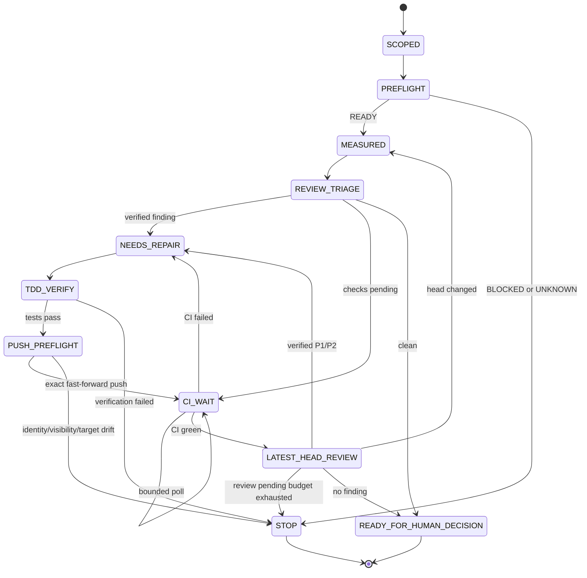

# ADR-0003: PR収束はbounded finite-state controllerとして実行する

- 状態: 採用
- 日付: 2026-08-19

## 背景

PRレビューのコメント、CI、HEAD、mergeabilityは非同期に変化する。自由形式の自動化で
「問題がなくなるまで繰り返す」と、古いHEADの証拠流用、重複mutation、無限待機、
コメント由来の未検証変更を招く。一方、個別の検査と安全境界は既存Core Suiteにあるため、
新しいmerge orchestratorを重複実装する必要はない。

## 決定

- 既存`pr-convergence-loop`を、PR番号・base SHA・head SHAへ束縛した有限状態制御として扱う。
- 各反復はsnapshot取得、次の安全な1操作、read-backの順で行う。
- 制御状態はidentity、visibility、base/head、dirty scope、tests、checks、review threads、
  retry使用量の有限な証拠ベクトルへ限定する。
- PRコメントは未信頼入力とし、ローカル再現、既存契約、独立機械検査で妥当性を確認できた
  修正だけを自動反映する。
- network/5xx、CI pending、外部review pendingには上限付きretryを設定する。
- mutation timeout後は同じmutationを再実行せず、remote stateをread-backする。
- head/base変更、identity/visibility drift、壊れたAPI応答、同一finding反復はfail-closedで停止する。
- 機械的終点は`READY_FOR_HUMAN_DECISION`とし、merge、Settings、runtime配布、cleanupは
  別の人間承認境界とする。

## 結果

- MPC的に毎回の観測から次の1手だけを再計画できる。
- 状態次元を有限の証拠ベクトルへ落とし、会話量やレビュー件数が増えても制御契約が膨張しない。
- 既存の`github-cli-ops-guard`、review監査、write preflight、post-merge closeoutを再利用する。
- GitHub Appやserver-side rulesetによる強制は別設定境界として扱う。

## 参照

- GitHub status checks: https://docs.github.com/en/pull-requests/reference/status-checks
- GitHub check runs: https://docs.github.com/en/rest/guides/using-the-rest-api-to-interact-with-checks
- GitHub GraphQL pagination: https://docs.github.com/en/graphql/guides/using-pagination-in-the-graphql-api
- ADR-0002: `docs/adr/0002-github-write-review-runtime-fail-closed.md`
